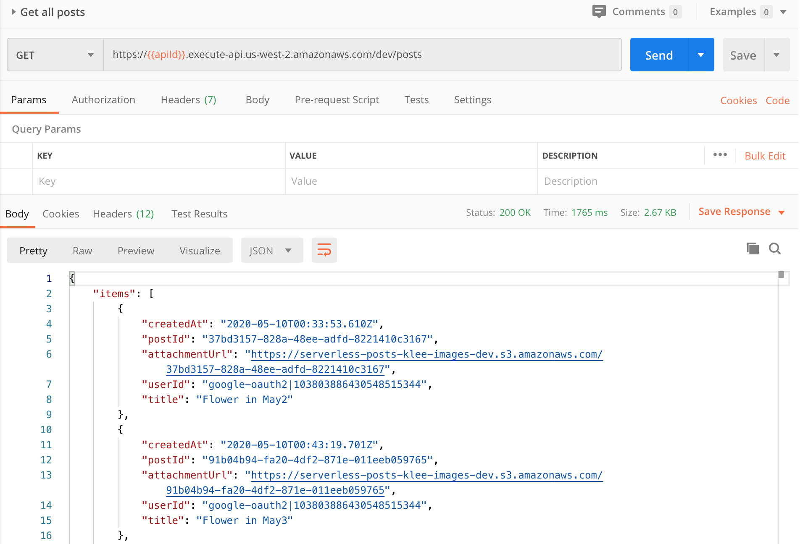
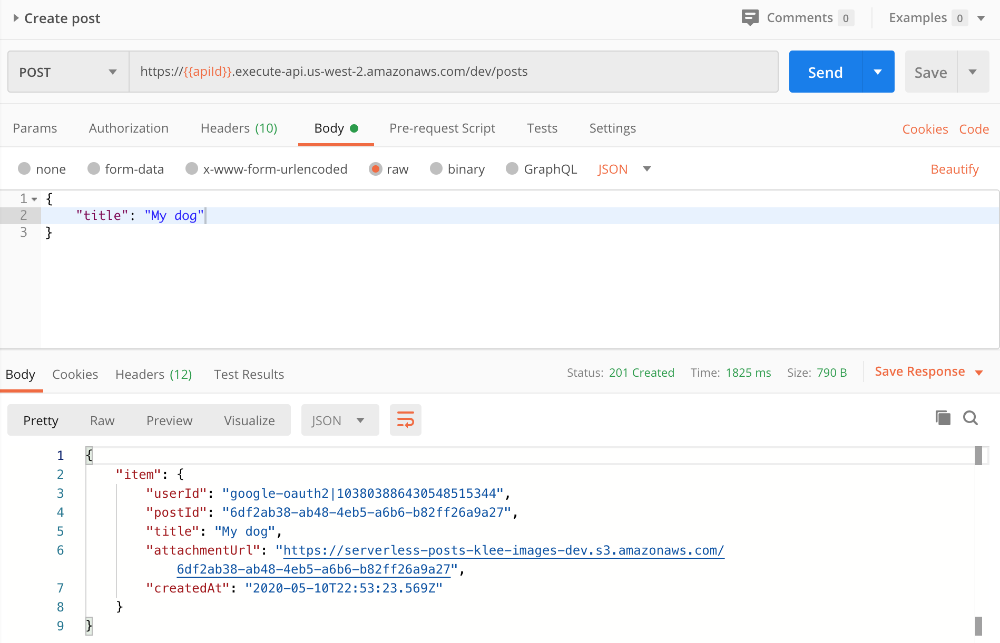
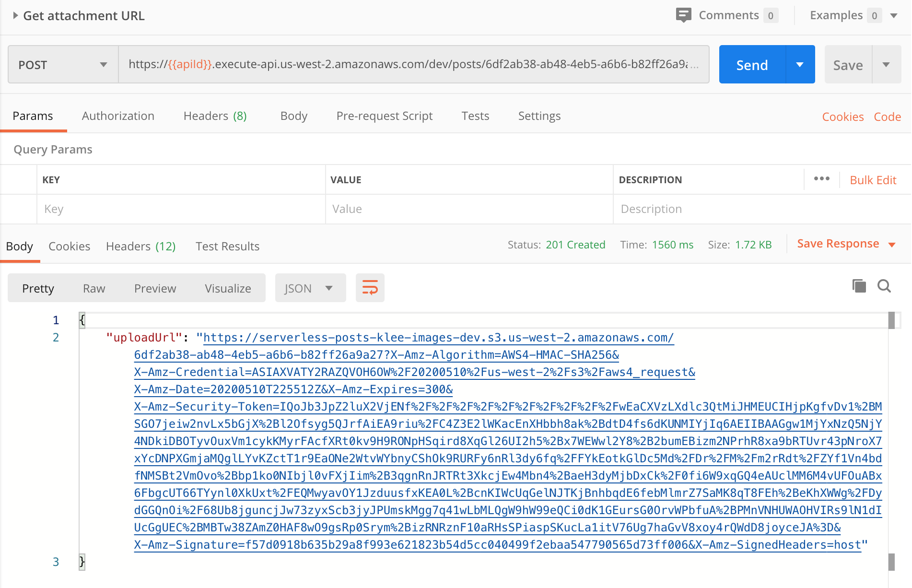
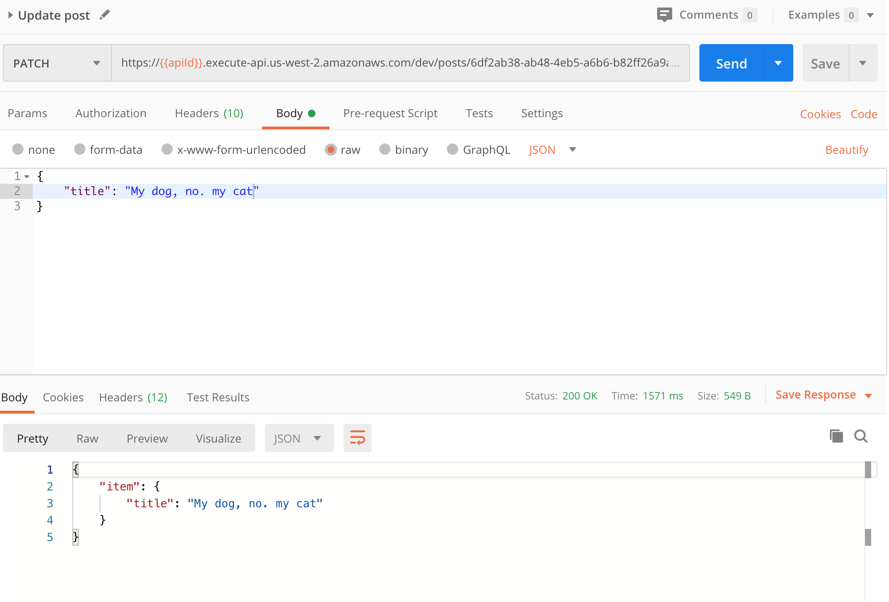
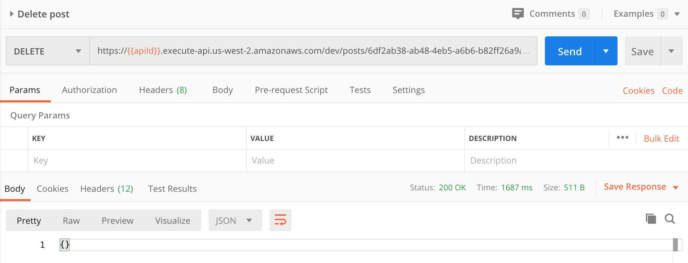
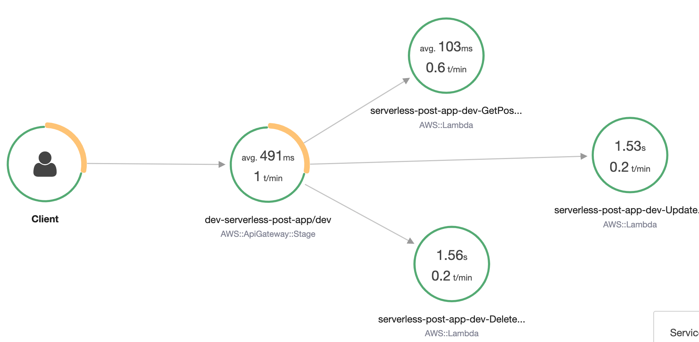

# cloud-developer-minigram-serverless
 
In this repository I implement a minimum version of Instagram(Minigram) using AWS Lambda, API Gateway, S3 and so on. This provides CRUD operations needed for Minigram.

--- 

## Set up Auth0 application
To integrate with Auth0 authentication visit [Auth0](https://auth0.com/) and create an application. Set up properties:

- Allowed Callback URLs: http://localhost:3000/callback
- JsonWebToken Signature Algorithm: RS256

Copy some properties to generate JWT Token for later use.

## Deploy project

To deploy project to AWS environment install serverless on local environment and run serverless deploy command.

Install Serverless Framework

```
npm install -g serverless
```

Install NPM dependencies
```
cd cloud-developer-minigram-serverless
npm i
```

Deploy project to dev environment
```
sls deploy -v --stage dev
```

---

## Test API endpoints
To test out API endpoints, use Postman application with a collection file in the repository.

### Prerequisite
- Generate AuthToken using `Client Secret` from Auth0.
- Run Postman
- Import cloud-developer-minigram-serverless/postman_collection.json
- Update variables: `apiId` and `authToken`.

### Get all posts
Call GET Get all posts command.




### Create a new post
Call POST Create a post command.



### Generate attachment URL
Call POST Get attachment URL command with a postId that was created by `POST Create a post command`.



### Upload Image
Call PUT command using the `uploadURL` that was created by `POST Get attachment URL command`. Need to select an image file from your local machine. 

### Update a post
Call PATCH command using the `postId` with updated title.



### Delete a post
Call DELETE command using the `postId`.



---

## Test WebSocket connnection and New Post Update Notification

To test WebSocket connection and Update Notification, need to install wscat. 

Install wscat
```
npm install -g wscat
```

Run wscat with WebSocket endpoint
```
wscat -c wss://avz7bun2cg.execute-api.us-west-2.amazonaws.com/dev
```

Receive a Update Notification message
```
example)
$ wscat -c wss://avz7bun2cg.execute-api.us-west-2.amazonaws.com/dev
Connected (press CTRL+C to quit)
< {"postId":"8a953f47-0c83-4041-a6c1-8dce1dc3ee40"}
```

---

## Image Resizing and Post Update Notification

When a new image is uploaded to IMAGE_S3_BUCKET, an event is sent to SNS Topic where two Lambda functions are subscribed to consume to resize image and send Update Notification to connected clients. Client has a persistent WebSocket connection to API Gateway and it receives a message which has a postId just created when a new image is uploaded.

--- 

## Distributed Tracing

Access to AWS X-Ray console and view a Service map to trace API calls. 



---

## System Monitoring

Access to AWS CloudWatch console and view Log groups for log messages. 

---

## Canary Deployment

Canary deployment is applied to `createPost`. New version of code will be taking traffic from API Gateway based on `deploymentSettings` property in serverless.yml. It sets to `Linear10PercentEvery1Minute` currently and this means a new version of Lambda function will take 10 percent more traffic every minute.

---

## Screenshots
- postman-get-all-posts.png: Get all posts
- postman-create-post.png: Create a post
- postman-get-attachment-url.png: Get attachmentURL
- postman-update-post.png: Update a post
- postman-delete-post.png: Delete a post
- aws-x-ray.png: X-Ray Service map